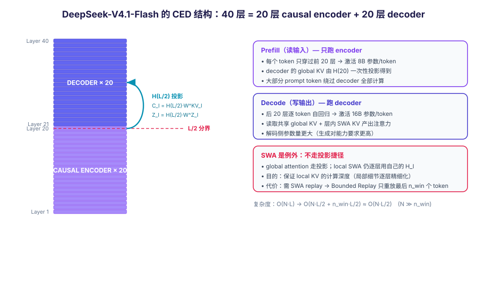

# DeepSeek-V4.1-Flash 的 Causal Encoder-Decoder 架构解析

## —— 与 Transformer Encoder-Decoder 的区别，以及相对 DeepSeek-V4 的架构升级

> 2026-09-13 · Damon + Nemesis · 分类：LLM 架构 · 标签：DeepSeek, CED, Encoder-Decoder, CSA2, KV Cache, MoE, 稀疏注意力

---

## 一、背景：V4.1-Flash 要解决的是什么问题

DeepSeek-V4.1-Flash（2026-09-10 发布）的整篇技术报告，副标题就是一句话：**Pushing the Limits of KV Cache Compression**（把 KV cache 压缩推到极限）。

它的出发点不是"模型不够聪明"，而是**成本结构变了**：

- 长程 agent 应用普及后，模型负载变成 **input-heavy**——agent 反复调用工具、反复把文件/日志/历史轮次塞回上下文，请求里绝大多数 token 是"输入"而不是"输出"。
- V4 已经通过稀疏注意力（CSA/HCA）大幅降低了长序列的**计算**成本，于是瓶颈转移到了：**prefill 计算** 和 **KV cache 的存储 / 持久化 / 传输**（HBM 容量、SSD 容量、I/O 带宽）。
- 每次 KV cache miss 都要重新 prefill 整段输入，这在 agent 场景下是常态而非例外。

所以 V4.1-Flash 的两条主线是：

1. **CED（Causal Encoder-Decoder）** → 砍 prefill 计算（近一半）
2. **CSA2 + FP4 KV + SWA Bounded Replay** → 砍 KV cache 的存储与持久化开销

---

## 二、模型规格

| 项目 | DeepSeek-V4-Flash | DeepSeek-V4.1-Flash |
|------|-------------------|---------------------|
| 架构 | Mixture-of-Experts decoder | **Causal Encoder-Decoder (CED)** |
| 语言主干层数 | —— | 40 层（20 encoder + 20 decoder） |
| Backbone 参数 | 284B | **552B** |
| 条件记忆参数 | 无 | **Engram 196B**（独立于 backbone） |
| 每 token 激活参数 | 13B | **prefill 8B / decode 16B** |
| 注意力 | CSA + HCA 混合 | **纯 CSA2**（+ 层次化稀疏 indexer） |
| 主 KV 精度 | FP8 | **FP4**（SWA KV 仍为 FP8） |
| 全局 KV cache | 基准 | **890 字节/token ≈ 1/4** |
| 持久化 KV cache | 基准 | **≈ 1/8** |
| 上下文长度 | 1M | 1M |
| 多模态 | 独立实验模型 | **原生**（预训练起就纳入） |
| 预训练语料 | 32T+ tokens | **45T tokens**（多模态语料） |

模型结构的关键数字：**40 层 Transformer，从中间劈成两半——下 20 层是 causal encoder，上 20 层是 decoder**。每层都同时含全局注意力和滑动窗口注意力（SWA），只有最前面两层例外（纯 SWA）。

---

## 三、CED 机制详解

### 3.1 一句话概括

> 把 decoder-only 的深层堆叠从中间切开：前半段只负责"生成一份 KV 笔记"，后半段拿着这份笔记开始写作——而不需要把原文再逐层读一遍。

### 3.2 层的划分

设总层数 $L = 40$：

- **下 $L/2$ 层（第 1–20 层）= causal encoder**
- **上 $L/2$ 层（第 21–40 层）= decoder**

这个划分只作用于**全局注意力**路径，SWA 路径另有安排（见 3.4）。

### 3.3 核心：全局注意力的 KV 由 encoder 末层投影而来

这是 CED 与一切传统架构的分水岭。

对于 decoder 的任意一层 $l > L/2$，它的全局 KV 条目**不再由自己的隐状态 $H_l$ 产生**，而是**直接从第 $L/2$ 层（即 encoder 最后一层）的隐状态 $H_{L/2}$ 投影得到**：

$$
C_l = H_{L/2} \, W^{KV}_l, \qquad Z_l = H_{L/2} \, W^{Z}_l, \qquad l > L/2
$$

其中：

- $C_l$ 是该层的 KV 条目，$Z_l$ 是对应的压缩权重（与 MLA 的 latent 结构呼应）；
- $W^{KV}_l$、$W^{Z}_l$ 是**逐层独立**的可学投影权重——这是关键细节：虽然所有 decoder 层拿的是**同一个** $H_{L/2}$，但每一层有自己的投影矩阵，因此得到的 KV 各不相同，层间仍然保留差异化表达。

**直接后果**：prefill 阶段只需要跑前 $L/2$ 层，就能以极小的额外代价拿到整个 decoder 的全局 KV cache。这就是 prefill 计算量近乎减半的来源。

### 3.4 SWA 是刻意保留的"例外"

CED 并没有把所有注意力都替换成投影。**滑动窗口注意力（SWA）仍然保持逐层的常规计算**——任意一层 $l$ 的局部 K/V 都由该层自己的隐状态 $H_l$ 得到。

这样做的目的是**保住 local KV 的计算深度**：局部依赖是逐层精细化提炼的，不能被一次投影草率替代。

但代价随之而来：既然 decoder 的 SWA KV 必须由各层自己算，prefill 时就需要**把 decoder 的局部窗口"重放"一遍**，代价是额外的 $n_{\text{win}} \times L/2$ 个 token。

解决方案是 **Decoder SWA Bounded Replay**：只对 prompt 的**最后 $n_{\text{win}}$ 个 token** 做 SWA prefill。依据是已有工作（Chen et al., 2025）发现 SWA 的**实际有效感受野远小于理论值** $n_{\text{win}} \times L/2$。论文报告这样做只有可忽略的性能损失。

这个取舍的意义在于：它建立了一个**新的存储–计算折中**——不再把 SWA KV 持久化到 SSD，而是在需要时用少量重算近似恢复。同一套思路也用在 encoder 侧的 SWA 状态重建上（host memory 中只保留长期存活的 global KV，短时 SWA 状态用 bounded replay 重建）。

### 3.5 复杂度

对序列长度 $N \gg n_{\text{win}}$：

$$
O(NL) \;\longrightarrow\; O\!\left(N\tfrac{L}{2} + n_{\text{win}}\tfrac{L}{2}\right) \approx O\!\left(\tfrac{NL}{2}\right)
$$

也就是 **prefill 总计算量减少约一半**。

### 3.6 与 CSA2 的协同

CED 和 CSA2 解决的是**互补**的两类成本：CED 管 prefill 计算，CSA2 管 KV 存储。

两者结合时的细节：decoder 中第一个被分配为 **Full Mode** 的 CSA2 层，它的全局 KV **就是**从第 $L/2$ 层的隐状态投影来的；Reindex / Reuse 两种模式不受 CED 影响。

此外，**层次化稀疏 indexer（Hierarchical Sparse Indexer）只在 CED 的 decoder 里启用**：第一个 Full Mode 层照常扫描全部因果可见位置并选出自己的 Top-K，同时做**块级候选筛选**（每个块取块内最大 index 分数，选最高分的若干块，例如 2048 块 × 8 位置 = 16,384 个候选位置）→ 构成一个**共享候选池**。后续 Reindex 层只在这个池子里打分。

效果：对固定候选池大小，**深层 indexer 每 query 的打分成本从"随上下文长度线性增长"变成常数**。只有第一个 Full Mode 层仍需全范围扫描。

### 3.7 非对称激活意味着什么

| 阶段 | 跑的层 | 激活参数 | 角色 |
|------|--------|----------|------|
| Prefill | 前 20 层 | **8B** | "读"——把输入压缩成 KV 笔记 |
| Decode | 后 20 层 | **16B** | "写"——真正生成输出 |

decode 侧激活更多参数，是因为**生成对能力的要求高于读取**：读只需要把信息整理成可用的 KV 表示，写则要调用完整能力去做推理和产出。

这个非对称设计精准命中了 agent 负载的特征——**读远多于写**，所以把便宜留给读、把能力留给写。

---

## 四、与经典 Transformer Encoder-Decoder 的区别

这是本文最需要说清的部分。CED 名字里带 "Encoder-Decoder"，很容易让人直接套用 Vaswani et al. (2017) 的经典结构——**但两者几乎在每个关键维度上都不同**。

### 4.1 逐维对比

| 维度 | 经典 Transformer Encoder-Decoder | DeepSeek CED |
|------|----------------------------------|--------------|
| **Encoder 注意力方向** | 双向（无 causal mask），作用是"理解源序列" | **因果 / 单向**（causal encoder）——因为它本质是自回归 LM 的前半段 |
| **Decoder 如何取用 encoder 输出** | **Cross-Attention**：decoder 每一层、每一步都重新读取 encoder 的全部输出 | **不是 cross-attention**：把 encoder 末层 $H_{L/2}$ 一次性**投影**成 decoder 的 global KV cache（式 1） |
| **参数量/激活的对称性** | 通常对称（encoder / decoder 规模相当） | **非对称**：prefill 8B / decode 16B |
| **层结构** | encoder 独立栈 + decoder 独立栈，两套权重 | **同一套 40 层 backbone 切成 20 + 20** |
| **训练目标** | Seq2seq（teacher forcing，源序列 → 目标序列） | **纯自回归 next-token prediction** |
| **设计动机** | 跨序列条件生成（翻译、摘要）：源与目标分布不同 | **省 prefill 计算 + 压 KV cache**，与"跨序列对齐"无关 |
| **SWA / 局部注意力** | 无（经典结构不含 SWA） | 有，且**刻意不走投影捷径**，逐层计算 local KV |

### 4.2 三个本质差异

**差异一：encoder 的角色完全不同。**

经典 E-D 里，encoder 是**理解器**——它把源语言句子编码成一组供 cross-attention 调用的上下文表示。
CED 里，encoder 是 **KV 生成器**——它存在的意义是产出一份可被投影的、供 decoder 使用的全局 KV 缓存。它不"理解"什么，它"准备"什么。

**差异二：decoder 访问 encoder 信息的方式完全不同，这是性能差异的根源。**

- 经典 E-D：decoder 的**每一层**都带一个 cross-attention 子层，**每一步解码**都要 attend 一遍 encoder 的完整输出 memory。encoder 的输出被反复读取 $L/2$ 次。
- CED：decoder 只在**第 $L/2$ 层**（encoder 末层）拿到一次 $H_{L/2}$，用逐层投影权重把它**一次性映射**成各层自己的 global KV，之后 decoder 各层就基于这份共享 KV 工作，**不再回读 encoder**。

正因为 CED 把"逐层重读"换成了"一次投影"，prefill 才能只跑一半的层——**这才是计算量减半的机制**，而不是简单地减少层数。

**差异三：因果性要求不同。**

经典 E-D 只有 decoder 需要因果性；encoder 是双向的，这恰恰是它"理解源序列"的能力来源。

CED 则**必须让 encoder 也保持因果**。原因很直接：decoder 的 global KV 直接来自 encoder 输出 $H_{L/2}$。如果 encoder 用了双向注意力，$H_{L/2}$ 就会包含**当前位置之后**的 token 信息；这些信息被投影成 decoder 的 KV 后，等于让 decoder 在预测第 $t$ 个 token 时"看见"了未来——**直接破坏自回归训练目标**。

所以 encoder 必须是 causal 的。这也正是它叫 **Causal** Encoder-Decoder 而不是 Encoder-Decoder 的原因——这个名字里的 "Causal" 就是与经典结构的分野标志。

### 4.3 一句话总括

> 经典 E-D 是"两个序列之间的翻译器"：encoder 双向理解源句，decoder 用 cross-attention 反复查阅源句，逐词生成目标句。
>
> CED 是"单个自回归模型的省算力切法"：前一半层把输入榨成一份 KV 笔记，后一半层拿着笔记直接开始写——没有源/目标之分，没有 cross-attention，只有一次投影和一份共享缓存。

---

## 五、相对 DeepSeek-V4 的架构升级

V4.1-Flash 相对 V4-Flash 不是简单放大（参数从 284B 涨到 552B），而是**在每个维度上都有结构改动**。

### 5.1 升级清单

| 维度 | DeepSeek-V4 | DeepSeek-V4.1-Flash | 目的 |
|------|-------------|---------------------|------|
| 架构范式 | Decoder-only | **CED**（20 encoder + 20 decoder，非对称 8B/16B） | 砍 prefill 计算 |
| 注意力 | CSA + HCA **混合** | **纯 CSA2** | 简化 + 统一复用策略 |
| 跨层复用 | 无 | **CSA2 跨层 KV / index 复用**（Full / Reindex / Reuse 三模式） | 砍 KV 存储 |
| Indexer | 全范围打分 | **层次化稀疏 indexer**（候选池） | 深层 indexer 成本降为常数 |
| 主 KV 精度 | FP8 | **FP4**（MXFP4 E2M1，SWA KV 保留 FP8） | KV 存储近半 |
| 部署 | 混合 SWA 缓存策略 | **SWA Bounded Replay** | 持久化 KV 降到 1/8 |
| 残差 | mHC（多 kernel） | **Single-Pass mHC + Mega-mHC kernel** | activation 访存减半 |
| 条件记忆 | 无 | **Engram 196B** | 记忆与计算解耦 |
| 投机解码 | MTP（与 backbone 联合训练） | **DSpark**（独立训练阶段） | 提升解码吞吐 |
| 优化器 | Muon | **head-wise Muon** + Engram 用 momentum/Sinkhorn | 逐头 preconditioner |
| 多模态 | 无 | **原生**（DeepSeek-ViT + MLP projector） | 视觉理解内置 |
| 预训练 | dense warmup 后再引入稀疏 | **稀疏注意力从 64K 直接从头训** | 去掉 warmup 阶段 |
| 语料 | 32T+ tokens | **45T tokens（多模态）** | 数据质量与覆盖 |

### 5.2 逐项说明

**① CSA2：从"混合"到"纯复用"**

V4 用 CSA（压缩 + 稀疏选择）+ HCA（重压缩 + dense）交错。V4.1 改成**纯 CSA2**，并把复用做到了三个可乘的维度上：

- **entry 维度**：GQA 减少 KV head 数，MLA 让多个 head 共享一个小的 latent；
- **序列维度**：每 $m$ 个 token 压成一个 entry；
- **层维度**：跨层复用 KV 与 Top-K 索引。

三种静态分配的模式：

| 模式 | 自己算什么 | 复用别人的什么 |
|------|-----------|---------------|
| **Full** | main KV、indexer Q，并从 main KV 投影出 indexer K，跑 indexer 得到新 Top-K | —— |
| **Reindex** | indexer Q（重新打分） | 复用前一层的 main KV + indexer K，但选新的 Top-K |
| **Reuse** | 只算 main Q 和 SWA KV | 复用前一层 main KV **和** Top-K 索引，不跑 indexer |

三者**都**自己计算 main Q 和 SWA KV。关键在于**缓存共享与索引复用被解耦**：Reindex 模式让存储共享的同时，稀疏选择仍可逐层变化。

相对 V4 的 CSA，CSA2 还简化了 compressor：去掉相邻压缩条目的**重叠**、去掉压缩时的**绝对位置编码**，并且 indexer K 直接由 main KV 投影得到（不再是独立压缩路径）。

**② 层次化稀疏 indexer**

跨层索引复用减少了 indexer 的**次数**，但剩下的 indexer 仍要扫全上下文。层次化设计让第一个 Full Mode 层建立候选池，后续层只在池内打分 → **每 query 成本从线性变成常数**。这个机制是**训练感知**的（训练和推理用同一限制域），在 post-training 阶段引入。

**③ FP4 主 KV cache**

V4 已经对 **indexer 的 QK** 做了 FP4 QAT。V4.1 把 QAT 扩展到 **main KV cache**：

- 用 OCP 标准 **MXFP4** 格式（为硬件兼容性，宁可牺牲一点精度）；
- 选 E2M1 + 每 16 通道一个 E4M3 scale（跟随 NVFP4，但**去掉二级全局 scale**以简化布局）；
- 论文论证省略全局 scale 是安全的：RMSNorm 后 512 通道 KV latent 的 L2 范数上界约 $\sqrt{512} \approx 22.6$，而该格式能表示的幅值上限是 $448 \times 6 = 2688$，留有充裕动态范围；
- 量化在 **RoPE 之后**做（RoPE 前量化仅有边际提升，却增加解码开销）；
- **SWA KV 保留 FP8**（对量化更敏感）。

相对 V4 的 FP8 主 KV，**存储足迹在 HBM 和 SSD 上都近乎减半**。

**④ SWA Bounded Replay**

V4 对持久化 SWA KV 用混合策略（Full Caching / Periodic Checkpointing / Zero SWA Caching）在存储与重算间取舍。V4.1 的做法是**不持久化 SWA KV**，需要时只重放最近 $n_{\text{win}}$ 个 token 重建 → **持久化 KV 降到约 1/8**。

**⑤ Single-Pass mHC + Mega-mHC**

V4 的 mHC 在相邻 block 间维护 $n$ 条残差流，部署时用三个 kernel 顺序执行（残差更新 → 系数预测 → 输入混合），activation 访存是理想下界 $(2n+2)d$ 的**两倍**（$(4n+4)d$）。

Single-Pass mHC 把**输入混合系数错开一个 block**（每个 block 用上一个 block 产生的系数）：

$$
X_{l+1} = B_l X_l + C_l F_l(A_{l-1} X_l), \qquad (A_l, B_l, C_l) = H(X_l)
$$

这样输入混合不再依赖本 block 当场算出的 $A_l$，消除了数据依赖 → 可以融合成单个 **Mega-mHC** kernel，达到 $(2n+2)d$ 的理想访存，**activation memory traffic 减半**。论文报告这个错位只带来可忽略的性能损失。

**⑥ Engram：把"记忆"从"计算"里拆出来**

196B 参数的条件记忆模块，均分到两个模块，放在**第 1 层和第 14 层**（平衡训练流水线各 stage 的显存）。配置：N-gram 阶数 {2, 3, 4}、8 个 hash head、每阶 embedding 维度 2048、每个 head 索引约 16M 条目（表大小取不同素数）。embedding 表与 key/value 投影都用 FP8。

相对原始 Engram 的两处改动：去掉短因果卷积（收益不足以抵消推理栈复杂度）；embedding 用 **momentum 更新 + Sinkhorn 平衡**优化。

推理时**确定性寻址**让 embedding 可以从 host memory 通过后台 RDMA 预取，第一个模块的预取与第一个 Transformer block 的计算重叠。

**⑦ DSpark：替换 MTP 的投机解码**

Drafter 是 3 个 Transformer block（SWA 窗口 128）。一次前向并行算出 5 个 draft 位置的 base logits，另有一个轻量 Markov head 建模 draft token 间的依赖；confidence head 预测每个位置的**条件接受概率**，进而估计前缀存活概率；scheduler 结合引擎吞吐曲线**动态选择验证长度**，最大化系统级吞吐。

关键差别：V3 的 MTP 是**与 backbone 联合训练**贯穿预训练；DSpark **在预训练之后单独训练**（backbone 冻结），post-training 阶段一起训但**不回传梯度到 backbone**。V4.1 的 backbone 预训练**直接去掉了 MTP 模块**。

**⑧ 优化器：head-wise Muon**

把 Query 权重**按 head 切开**再施加 Muon 更新。把 Muon 看作预条件梯度下降后，原版 Muon 对所有 head 用同一个 preconditioner，head-wise 版本让不同 head 有各自的 preconditioner，能更好地处理**注意力头之间的异质性**。

另外，给 Engram 参数用 Adam 会大幅推高优化器状态显存，因此 Engram embedding 表、token embedding 和 prediction head 改用 **momentum 更新 + Sinkhorn 平衡**。

**⑨ 原生多模态**

输入通路 = 视觉编码器 + MLP projector。

- **DeepSeek-ViT**：基于 ViT 从头训练，支持任意分辨率——用 **2D-RoPE** 替代绝对位置编码；为兼容 Muon 优化器，把 patch embedding 的**卷积换成线性投影**；用 RMSNorm + SwiGLU。
- **3×3 pixel-unshuffle**：把视觉 token 数**减少到 1/9**，从而支持约 1344×1344 的输入分辨率。
- **模态特定的无辅助损失负载均衡**：图像和文本 token 的表示分布不同、专家路由偏好也不同。V4.1 为两种模态**分别维护一套专家偏置**，各自独立更新——避免用聚合负载掩盖模态内的不均衡。

**⑩ 训练与后训练**

- 预训练 **45T tokens 多模态语料**；稀疏注意力**从 64K 序列长度直接从头训**，没有任何 dense attention warmup 阶段。
- 后训练**没有算法创新**：就是标准 SFT → RL → OPD 三段式，改动全在数据管线（大规模自动化数据合成、环境构建，逐步扩大 RL 的数据/任务/rollout 规模）。

---

## 六、效果验证

### 6.1 KV cache 与计算量

| 指标 | 结果 |
|------|------|
| 全局 KV cache（常驻 HBM） | **890 字节/token**，约为 V4-Flash 的 **1/4** |
| 持久化 KV cache（SSD / host memory） | 约为 V4-Flash 的 **1/8** |
| 相对初代 DeepSeek-V1 | 每 token 全局 KV **缩小约 437 倍** |
| Decode FLOPs vs 上下文长度 | 上下文从 4K 扩到 1M（256 倍），**Decode FLOPs 只增加 1/4** |
| HBM / SSD 需求 | 分别降至 **1/4** 和 **1/8** |

论文 Figure 2 显示：V4.1-Flash 的**单 token Decode FLOPs 随上下文长度几乎保持恒定**——这是 CED + CSA2 组合的直接结果。

### 6.2 Base 模型对比（论文 Table 1）

| Benchmark | V4-Flash-Base | V4-Pro-Base | **V4.1-Flash-Base** |
|-----------|---------------|-------------|---------------------|
| 激活参数 | 13B | 49B | **8B / 16B** |
| Backbone 参数 | 284B | 1.6T | **552B** |
| AGIEval | 83.9 | 84.4 | 83.4 |
| MMLU-Pro | 68.3 | 73.5 | **74.1** |
| C-Eval | 92.1 | 93.1 | 92.1 |
| MultiLoKo | 42.6 | 50.9 | 45.5 |
| SimpleQA-Verified | 30.1 | **55.2** | 42.3 |
| SuperGPQA | 46.5 | 53.9 | 53.1 |
| BBH | 86.9 | 87.5 | 86.1 |
| DROP (F1) | 88.6 | 88.7 | 87.9 |
| HumanEval | 69.5 | 76.8 | **79.4** |
| GSM8K | 90.8 | 92.6 | **93.0** |
| MATH | 57.4 | 64.5 | 61.1 |
| MGSM | 85.7 | 84.4 | 80.2 |
| LongBench-V2 | 44.7 | 51.5 | 45.2 |
| MMMU-Pro | —— | —— | **56.5** |
| DocVQA | —— | —— | **95.6** |

论文的说法是：V4.1-Flash-Base 的世界知识、推理、编码能力**与 V4-Pro-Base 相当**，在 held-out 评测上提升 5%–10%，**只用了 1/3 的总参数和 1/4 的激活参数**。

但要注意一个**诚实的数据点**：SimpleQA-Verified 上 V4.1（42.3）明显低于 V4-Pro（55.2），MultiLoKo（45.5 vs 50.9）、MGSM（80.2 vs 84.4）也落后。**参数体量的差距在纯知识类任务上依然存在**。

### 6.3 与前沿模型对比（论文 Table 3，节选）

| Benchmark | Opus-5 | GPT-5.6 Sol | K3 | GLM-5.3 | DS-V4-Pro | DS-V4-Flash | **DS-V4.1-Flash** |
|-----------|--------|-------------|----|---------|-----------|-------------|-------------------|
| GPQA Diamond | 93.4 | **94.1** | 92.9 | 88.1 | 92.4 | 89.9 | 90.9 |
| Codeforces (Rating) | —— | —— | 3348 | 3289 | 3348 | 3289 | **3471** |
| MathArena Apex | —— | —— | **65.6** | 65.3 | 65.3 | 58.6 | **65.6** |
| Terminal-Bench 2.1 | 89.1 | 88.8 | 88.3 | 88.2 | 87.9 | 82.7 | **90.6** |
| Terminal-Bench 3.0 | **43.3** | 34.4 | 17.7 | 28.3 | 11.8 | 7.6 | 30.0 |
| Terminal-Bench 4.0 | **51.8** | 39.9 | 12.6 | 37.9 | 12.4 | 7.0 | 31.2 |
| DeepSWE v1.1 | 74.0 | 73.0 | 67.5 | 66.9 | 62.7 | 54.4 | **74.2** |
| Automation-Bench | 50.3 | 45.8 | 46.7 | 48.8 | 43.2 | 37.7 | **54.8** |
| Agents' Last Exam | 28.6 | 26.7 | 27.6 | 28.5 | 25.7 | 25.2 | **31.8** |
| CyberGym | —— | 84.5 | 80.0 | 84.5 | 83.3 | 76.7 | **88.1** |

能力画像很清晰：

- **Agentic 任务上很强**：Terminal-Bench 2.1（90.6）、DeepSWE v1.1（74.2）、Automation-Bench（54.8）、Agents' Last Exam（31.8）**全面第一**，超过 Opus-5 和 GPT-5.6 Sol。
- **推理任务上持平**：Codeforces 3471 超过 V4-Pro（3348）和 V4-Flash（3289）；MathArena Apex 65.6 追平 Kimi-K3。
- **硬科学 agentic 任务仍有差距**：Terminal-Bench 4.0 只有 31.2，远低于 Opus-5 的 51.8——论文自己承认"**在需要专家级领域知识的科学类 agentic 任务上，与巨型模型的差距依然存在**"。

---

## 七、局限与遗留问题

论文在 Conclusion 里主动列了几点：

1. **新架构带来了尚未充分刻画的鲁棒性边界。** CSA2 的**选择误差**与 SWA Bounded Replay 的**近似状态重建**，都可能在未覆盖的极端输入/部署条件下造成能力退化。论文表示会持续压力测试，重点关注**长上下文稀疏检索**和 **cache 恢复边界处的 SWA 状态重建**。
2. **基准已接近饱和。** 模型在多数日常任务上表现已接近顶级模型，但在**最困难的推理和边界情况**上仍有差距——"分数接近不等于前沿能力等价"。
3. **参数体量的硬约束仍在。** 如 6.2/6.3 所示，纯知识任务（SimpleQA-Verified 等）和专家级科学 agentic 任务上，无捷径可走。

另外几个**设计上就能看出的取舍**：

- **encoder 的信息瓶颈**：decoder 的全局 KV 全部来自单一层 $H_{L/2}$，中间没有更多的交互层。相比经典 E-D 的逐层 cross-attention，这是一种**有意的信息压缩**——用表达力换 prefill 成本。
- **SWA 依赖近似重建**：Bounded Replay 依据的是"有效感受野远小于理论值"这一经验观察，属于**近似**而非精确重建。
- **后训练零创新**：论文明确说 post-training "refrain from introducing novel algorithms"——能力提升主要来自数据管线与规模，而非算法。

---

## 八、关键启发

1. **"Encoder-Decoder"这个词已经被重新定义了。** CED 里的 encoder 不是"理解源序列"，而是"生成可投影的 KV 表示"。同一个术语在不同时代指向完全不同的机制——读论文时不能被名字带着走。
2. **省算力的方向从"注意力"转向了"prefill"。** V3/V4 时代的主线是压注意力复杂度和 KV 长度；V4.1 指出当稀疏注意力把计算压下去之后，**prefill 计算和 KV 的存储/传输**才是新的主战场。
3. **"一次投影"取代"逐层重读"是核心手法。** 经典 cross-attention 是 $L/2$ 次重复读取；CED 是一次投影。这个替换同时带来了计算减半和缓存共享——**架构上的"去重复"往往比"加加速器"更有效**。
4. **对 SWA 网开一面是成熟的设计判断。** CED 没有为了漂亮把一切都统一成投影，而是明确保留 SWA 的逐层计算以维持局部表达力，再用 Bounded Replay 把代价压回去。**关键路径走捷径、局部路径保精度**，是一个可迁移的取舍范式。
5. **非对称设计是负载感知的产物。** 8B 读 / 16B 写不是审美选择，而是对"agent 读多写少"这一负载特征的直接回应。**架构应该跟着负载成本结构调整，而不是跟着参数量攀比。**
6. **与我们的 RAG / 长上下文研究相关**：V4.1 的层次化稀疏 indexer（先粗选块、再在候选池内精排）与我们讨论过的**两阶段检索**（召回 → 精排）在结构上同源。压缩 + 候选池 + 池内重排，既能用在注意力里，也能用在检索里。
7. **与流形约束主线的连接**：Single-Pass mHC 通过**错开一个 block 的系数**来消除数据依赖，从而把三个 kernel 融成一个——和 mHC 用 Sinkhorn 投影把自由矩阵约束到双随机流形，都是"**为了让系统可融合、可稳定，宁可牺牲一点点理论最优**"。工程约束反过来塑造了架构形式。

---

## 参考来源

- 论文原文：**DeepSeek-V4.1-Flash: Pushing the Limits of KV Cache Compression**，DeepSeek-AI，2026-09-10
  - 官方 PDF：https://huggingface.co/deepseek-ai/DeepSeek-V4.1-Flash/blob/main/DeepSeek_V41_Tech_Report.pdf
  - 模型权重：https://huggingface.co/deepseek-ai/DeepSeek-V4.1-Flash
- 官方发布公告：https://www.deepseek.com/zh/news/deepseek-v4-1-flash
- 相关前置工作：DeepSeek-V4 技术报告（本库另有 `deepseek-v4-technical-report-summary.md`）
- CED 的灵感来源：YoCo (Sun et al., 2024) —— 上层直接共享下层产生的 KV cache
- SWA 有效感受野观察：(Chen et al., 2025)

---

## 元信息

- 生成者：Damon + Nemesis
- 日期：2026-09-13
- 来源文件：DeepSeek-V4.1-Flash 技术报告（HuggingFace 官方 PDF）
- 配图：`figures/ced-architecture.svg`（程序化生成）
