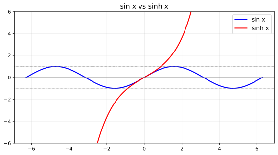
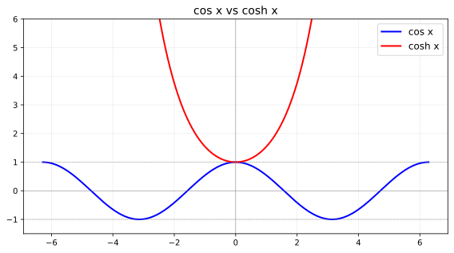
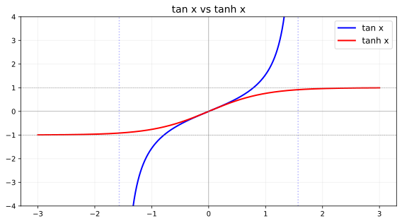
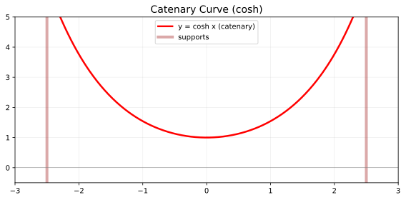
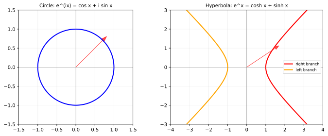

# 双曲函数 vs 三角函数 — 完整对比

> 2026-06-09 · Nemesis · 标签：数学， 函数， 双曲函数， 三角函数

---

## 一、定义对比

### 1.1 sin vs sinh

| 属性 | sin x（正弦） | sinh x（双曲正弦） |
|------|-------------|------------------|
| **定义式** | sin x = (e^{ix} − e^{-ix})/(2i) | sinh x = (e^x − e^{-x})/2 |
| **定义域** | ℝ（所有实数） | ℝ（所有实数） |
| **值域** | [−1, 1]（**有界**） | (−∞, +∞)（**无界**） |
| **奇偶性** | 奇函数 | 奇函数 |
| **周期性** | 周期 2π | **非周期**（虚周期 2πi） |
| **零点** | x = nπ (n∈ℤ) | x = 0（唯一实零点） |
| **几何** | 单位圆上点的 y 坐标 | 双曲线 x²−y²=1 上点的 y 坐标 |

```
sin x：    转圈 → 有界震荡 (蓝色曲线)
sinh x：   沿双曲线 → 指数增长 (红色曲线)



### 1.2 cos vs cosh

| 属性 | cos x（余弦） | cosh x（双曲余弦） |
|------|-------------|------------------|
| **定义式** | cos x = (e^{ix} + e^{-ix})/2 | cosh x = (e^x + e^{-x})/2 |
| **定义域** | ℝ | ℝ |
| **值域** | [−1, 1]（**有界**） | **[1, +∞)**（有下界，无上界） |
| **奇偶性** | 偶函数 | 偶函数 |
| **周期性** | 周期 2π | **非周期**（虚周期 2πi） |
| **最小值** | −1 | **1**（在 x=0 处） |
| **几何** | 单位圆上点的 x 坐标 | 双曲线 x²−y²=1 上点的 x 坐标 |

> **口诀**：cosh 像微笑曲线，永远 ≥ 1；cos 像波浪，在 −1 和 1 之间摆荡。

### 1.3 tan vs tanh

| 属性 | tan x（正切） | tanh x（双曲正切） |
|------|-------------|------------------|
| **定义式** | tan x = sin x / cos x | tanh x = sinh x / cosh x = (e^x−e^{-x})/(e^x+e^{-x}) |
| **定义域** | ℝ \\ {π/2 + nπ} | **ℝ**（所有实数） |
| **值域** | (−∞, +∞)（无界） | **(−1, 1)（有界！）** |
| **奇偶性** | 奇函数 | 奇函数 |
| **渐近线** | **垂直渐近线** x = π/2 + nπ | **水平渐近线** y = ±1（x→±∞） |
| **周期性** | 周期 π | 非周期（虚周期 πi） |

```
tan x：  ╱╲╱╲╱╲  垂直渐近线隔开，周期震荡
tanh x： ╭──╮    从 -1 到 1 的 S 形光滑过渡
```

---

## 二、函数图形对比（SVG 实际曲线）

蓝色 = 三角函数，红色 = 双曲函数

### sin vs sinh


### cos vs cosh


### tan vs tanh


### 悬链线（cosh 的物理图形）


### 欧拉公式对比：圆周 vs 双曲线


---

## 三、核心恒等式对比

### 毕达哥拉斯恒等式（⚠️ 关键差异！）

| 三角函数 | 双曲函数 |
|---------|---------|
| cos²x + sin²x = 1 | cosh²x − sinh²x = **1** |

> 唯一的符号差异——三角加，双曲减。来源：定义式中的 i。

### 加法公式对比

| 运算 | 三角函数 | 双曲函数 |
|------|---------|---------|
| 和角 | sin(x+y) = sin x cos y + cos x sin y | sinh(x+y) = sinh x cosh y + cosh x sinh y |
| 和角 | cos(x+y) = cos x cos y − sin x sin y | cosh(x+y) = cosh x cosh y + sinh x sinh y |
| 倍角 | sin 2x = 2 sin x cos x | sinh 2x = 2 sinh x cosh x |
| 倍角 | cos 2x = cos²x − sin²x | cosh 2x = cosh²x + sinh²x |

> 注意 cos(x+y) 与 cosh(x+y) 的符号差异：三角带负号，双曲无负号。

### Osborne's Rule

> 将三角恒等式转为双曲恒等式的规则：**把每个 sin² 替换为 −sinh²。**

例如：
- cos²x + sin²x = 1 → cosh²x + (−sinh²x) = 1 → cosh²x − sinh²x = 1
- 1 + tan²x = sec²x → 1 − tanh²x = sech²x

---

## 四、导数与积分对比

| 函数 | 导数 (三角) | 导数 (双曲) |
|------|-----------|-----------|
| sin/sinh | cos x | cosh x |
| cos/cosh | −sin x | **sinh x** |
| tan/tanh | sec²x | sech²x |
| cot/coth | −csc²x | −csch²x |
| sec/sech | sec x tan x | −sech x tanh x |
| csc/csch | −csc x cot x | −csch x coth x |

> 注意 cos 与 cosh 导数的符号差异！

---

## 五、级数展开对比

| 函数 | 泰勒展开（前几项） |
|------|------------------|
| sin x | x − x³/3! + x⁵/5! − x⁷/7! + …（**交错**） |
| sinh x | x + x³/3! + x⁵/5! + x⁷/7! + …（**全正**） |
| cos x | 1 − x²/2! + x⁴/4! − x⁶/6! + …（**交错**） |
| cosh x | 1 + x²/2! + x⁴/4! + x⁶/6! + …（**全正**） |
| tan x | x + x³/3 + 2x⁵/15 + …（交错） |
| tanh x | x − x³/3 + 2x⁵/15 − …（交错，与 tan 相同但符号相反） |

> **关键**：系数完全相同，三角交错符号、双曲全正符号。唯一区别是 tan 和 tanh 的展开系数完全相同但 tan 的符号模式固定（与伯努利数相关）。

---

## 六、复平面桥接：复数域的统一

通过复变函数，三角与双曲完全统一：

| 关系 | 公式 |
|------|------|
| sin → sinh | sin(ix) = i sinh x |
| cos → cosh | cos(ix) = cosh x |
| tan → tanh | tan(ix) = i tanh x |
| sinh → sin | sinh(ix) = i sin x |
| cosh → cos | cosh(ix) = cos x |
| tanh → tan | tanh(ix) = i tan x |

**欧拉公式对比：**

$$
e^{ix} = \cos x + i\sin x \quad\text{(圆周运动)}
$$
$$
e^{x} = \cosh x + \sinh x \quad\text{(双曲线运动)}
$$

> 三角函数是**旋转**（在复平面上转圈），双曲函数是**滑动**（沿实轴指数增长）。

---

## 七、物理应用对比

| 三角函数 | 双曲函数 |
|---------|---------|
| 简谐运动、波动方程 | 悬链线（cosh 描述悬挂的链条/电线） |
| 交流电（相位、阻抗） | RL 电路放电（指数衰减） |
| 傅里叶分析（周期信号分解） | 洛伦兹变换（相对论快度 **rapidity**） |
| 量子力学（波函数相位） | 速度相加（tanh η 加法公式） |
| 导航（经纬度计算） | 热传导中的瞬态温度分布 |
| 几何：Euclidean 旋转 | 几何：Minkowski 时空的双曲旋转 |

**悬链线（Catenary）**：一条均匀链条两端悬挂的形状 = cosh 曲线：

$$
y = a\cosh\frac{x}{a}
$$

**相对论快度（Rapidity）**：相对论速度叠加实际上就是双曲正切加法：

$$
\eta = \operatorname{artanh}\frac{v}{c},\quad v = c\tanh\eta
$$

两个速度叠加：$\eta_{\text{total}} = \eta_1 + \eta_2$（线性！），而 $v_{\text{total}} = c\tanh(\eta_1 + \eta_2)$。

---

## 八、总览对照表

| 维度 | 三角函数 | 双曲函数 |
|------|---------|---------|
| **几何来源** | 单位圆 x² + y² = 1 | 单位双曲线 x² − y² = 1 |
| **周期性** | 有（实周期） | 无（有虚周期） |
| **有界性** | sin, cos 有界 [−1, 1] | sinh, cosh 无界 |
| **恒等式符号** | cos² + sin² = 1 | cosh² − sinh² = 1 |
| **级数符号** | 交错 ± | 全正 + |
| **复数桥接** | sin(ix) = i sinh x | sinh(ix) = i sin x |
| **欧拉公式** | e^{ix} = cos x + i sin x | e^x = cosh x + sinh x |
| **物理空间** | Euclidean（旋转） | Minkowski（boost） |

---

*创建时间: 2026-06-09*
*分类: Cognition/Math*
